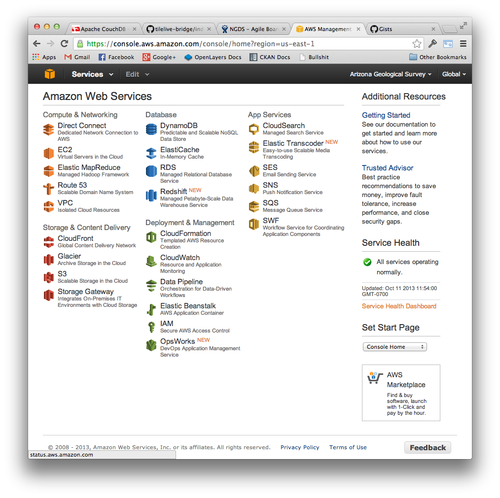
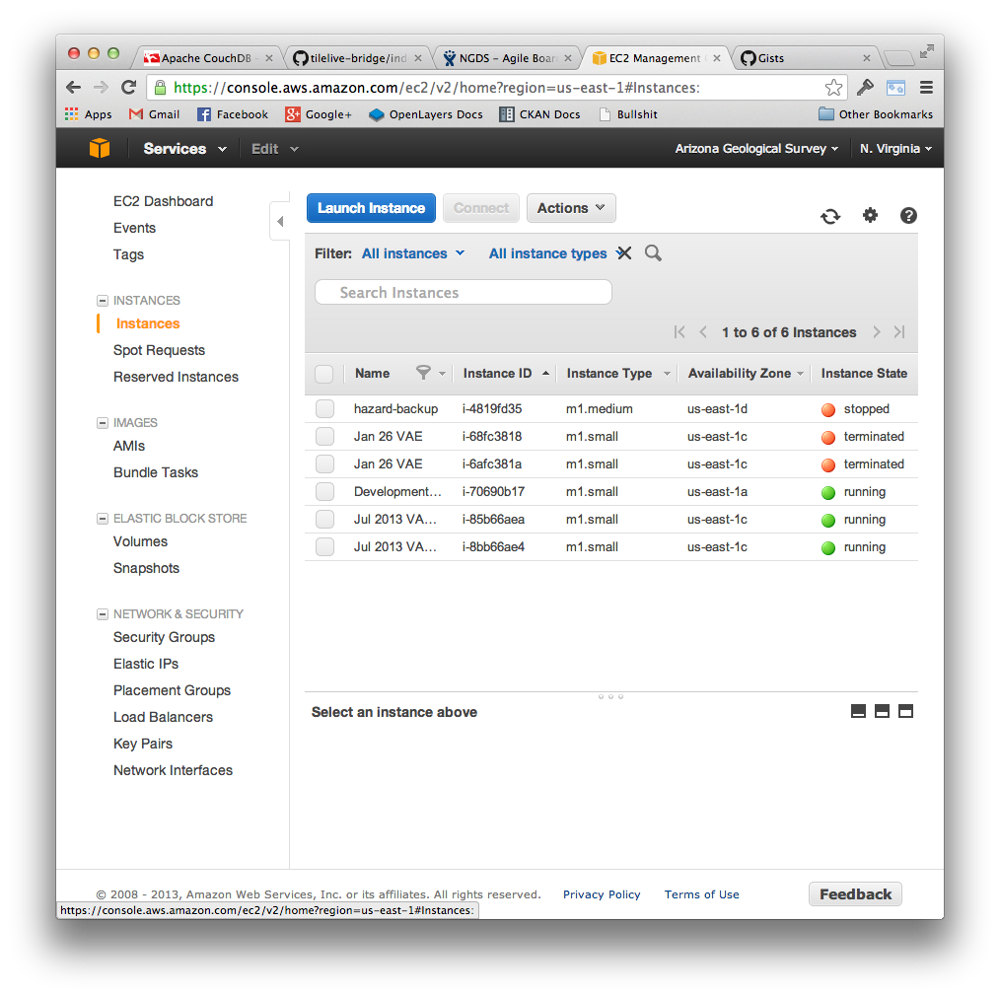
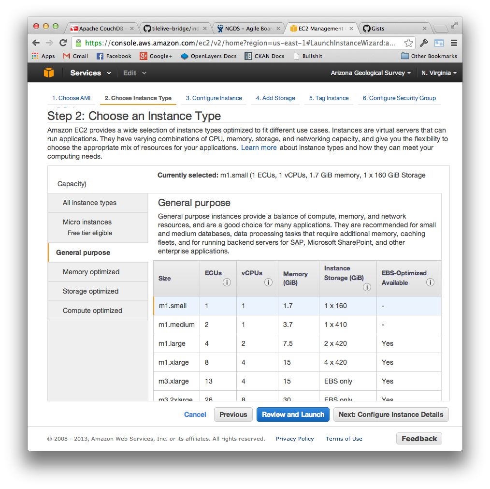
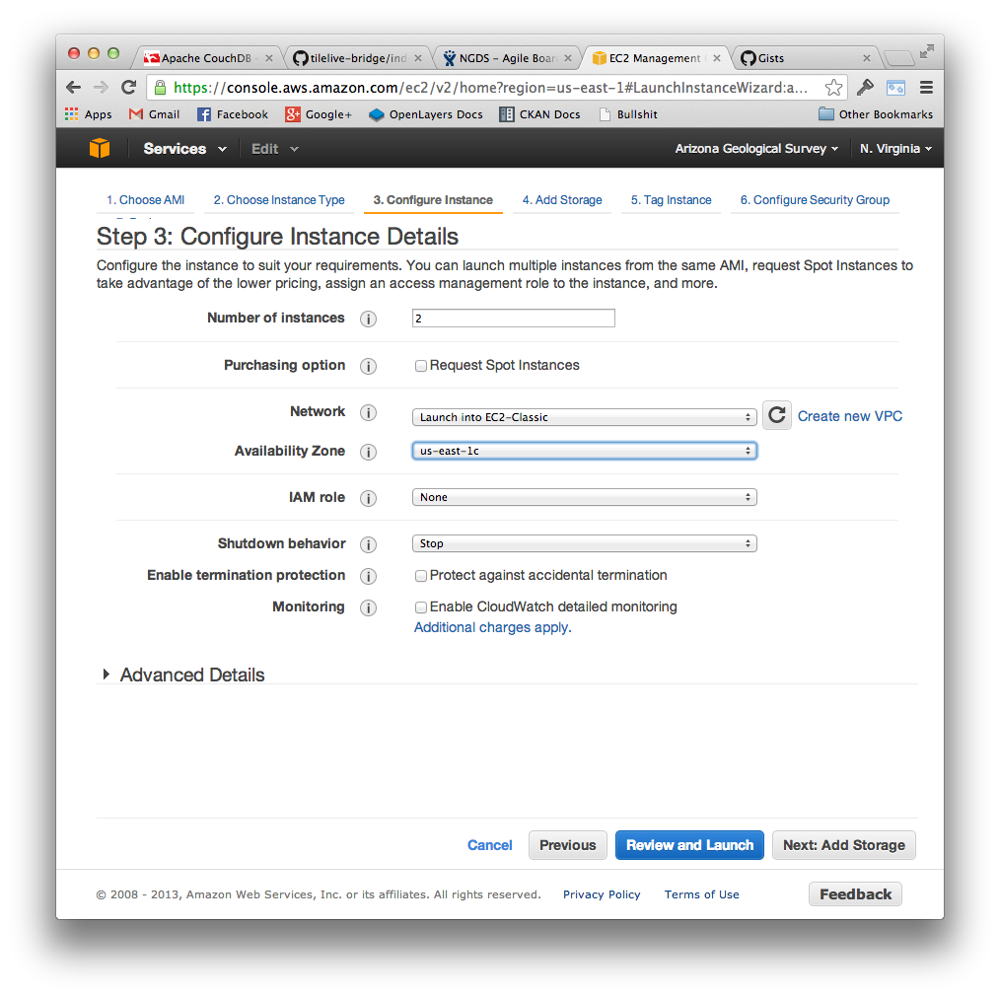
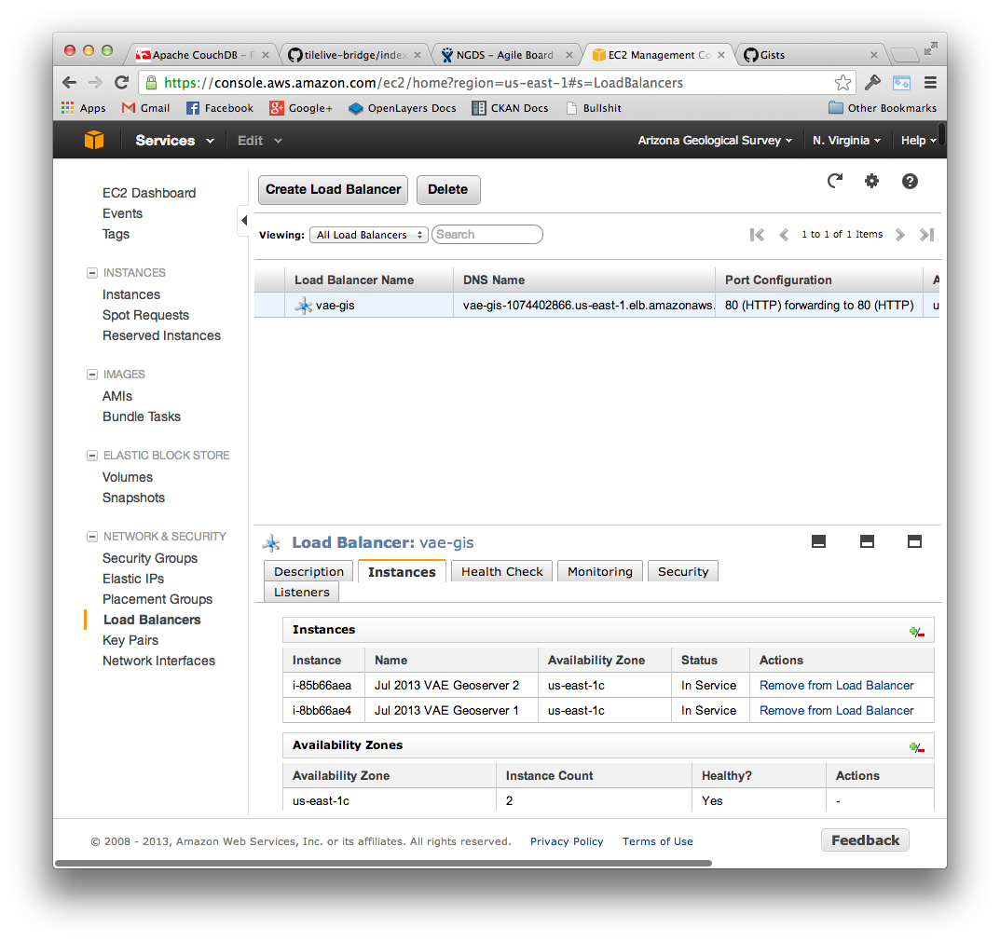

# VAE EC2 Instructions

## How it is set up

There are three moving parts:

- a load balancer, which is what all the requests go to for VAE data. This is the "live site".
- two worker bees, which are VMs that run Geoserver. The Load Balancer sends requests to one or the other of these VMs.
- a developement machine, that you log onto to make new changes and experiment without affecting anything that's live.

## What it means to go live

When you "push changes live", what it means is that you 

1. make changes to the development machine, then
2. make two copies of the development machine, then
3. put those new machines behind the Load Balancer, and
4. remove the old worker bees from the load balancer, which makes your new machines the new, live, worker bees

## Log into the Amazon Management Console

It is at https://console.aws.amazon.com, and the username is `hazard-web@azgs.az.gov`. The password needs to be kept very secret. It will look like this:

Go to the **EC2** part, then navigate to the **Instances**. It should look something like this:

These are the VMs that are running, and their status. You can perform various *Actions* by checking the box next to one or more VMS, then picking the appropriate action from the menu at the top of the screen. Primarily, you'll use this to start, stop, destroy, and clone VMs.

Some terms of interest:
- *Stopping* a VM is like pulling the power cable out. It forces the machine off, but it can be turned on later.
- *Starting* a VM is just booting it up.
- *Terminating* a VM is like destroying it. This is not a recoverable action.
- *Creating an Image* of a VM is a way to clone it. Once you have an image, you can use that image to start new, identical VMs.

If the development machine isn't online, you can start it, and wait until it reports that it is ready. Then you can make some changes. Once you're finished with your changes and ready to deploy, you should...

## Clone the Dev Machine

From the console, check the development machine's box and pick *Create Image* from the Actions menu. You'll be asked to give your image a name and description. I've been naming them something like `VAE-2013-05-04` for an image that I made on May 4th. You don't need to change anything about *Instance Volumes* unless you need to give new worker bees more hard-disk space.

Creating the Image will take a few minutes, and during that time the dev machine will be unavailable.

## Make two new worker bees

Once the image is created, you will find it by navigating to *AMIs* from the menu on the left. *AMI* is for *Amazon Machine Image*. List will show you a list of all the images that we've created. Select the one that you just created and hit the big "Launch" button.

### Instance Size

You need to specify the "size" of your new worker bees. We want to choose *General Purpose > m1.small*. Then click *Next*.

### Instance Details

You need to specify the correct "Availability Zone" for the instances. This has to match our load balancer. The correct zone is `us-east-1c`. You should also specify that you want two new instances. Once you've done that, click *Next*.

### Add Storage

... accept defaults unless you need more space.

### Tag Instance

This allows you to give your Instances a "name", which appears on the Instance list. This is just for helping you keep things straight, and can be changed later. I might call them something like "New Worker Bee". The tag will be applied to every new VM that you've told it to make.

### Security Groups

Security Groups are a set of Firewall Rules. For VAE you'll want to select an existing group: `vae-gis`. Once you've done that, click the *Review and Launch* button, make sure everything looks right, and then *Launch*. 

The new machines will show up in the instance list and will take a few minutes to be ready.

## Adjusting the Load Balancer

Once the new VMs are ready, you'll want to put them behind the load balancer. To do this, navigate to *Load Balancers* from the menu on the left, select our one load balancer from the list, then select the *Instances* tab on the bottom half of the screen.

The `+/-` button is what you use to select new instances to add the the balancer, or to remove isntances from the balancer. I would recommend adding the two new instances, then waiting 5 minutes or so until they are ready (status will chance to "In Service"), and then removing the old instances. At this point your changes should be implemented live.

## Terminate the old instances

Once your confident that they new instances are working as you'd like them to be, and that nothing is broken on the live site, its safe for you to destroy the old worker bees. Do this on the *Instances* page. While terminating a machine is non-recoverable, because of the workflow that we're following here, we still have AMIs for the old machines, and we could spin up new ones if we had to.

## Final Note

We built this system with a concept that VAE was going to generate an enormous amount of traffic. That didn't play out as much as we might have anticipated, and I personally think that this load-balanced workflow is a bit of overkill right now. I would be interested in scaling this back to just one machine, possibly on our local network, if that is desired.
